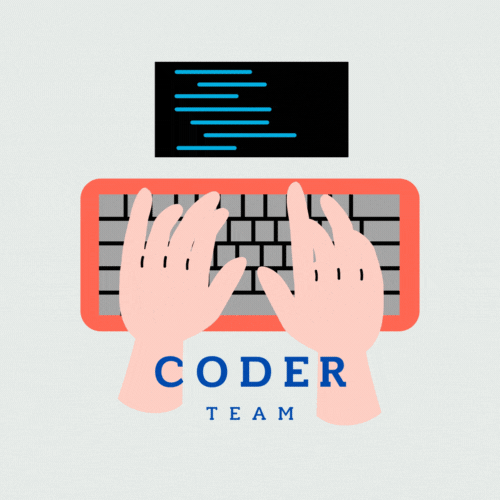

# CoderTeam-Ecommerce
## UTN/San Rafael   


Este proyecto es parte de ... y tiene como objetivo ...

## Tabla de Contenidos

- [¿Cómo correr el proyecto?](#¿cómo-correr-el-proyecto?)
  - [Requisitos](#requisitos)
  - [Instalación](#instalación)
  - [Uso](#uso) 
- [Contribución](#contribución)
- [Site Preview](#site-preview )

  
## ¿Cómo correr el proyecto?

hggblj

## Requisitos

Para ejecutar este proyecto, necesitas tener instalado Python 3 y las siguientes bibliotecas:
```bash
- Django (version 4.2.7)
- Pillow
```

Puedes instalar estas bibliotecas utilizando pip:

Opción 1:
```bash
pip install -r requirements.txt
```
Opción 2:
```bash
pip install django Pillow
```

## Instalación

1. Clonar este repositorio en tu máquina local.
```bash
git clone https://github.com/tu-usuario/tu-proyecto.git
```

2. Navega al directorio del proyecto.
```bash
cd tu-proyecto
```
3. Ejecuta el proyecto.
```bash
python main.py
```

## Uso

Este proyecto consta de varios módulos:

- **...**: Contiene funciones para ....
- **...**: Automatiza ....
- **...**: Analiza y visualiza ....

## Contribución

Si deseas contribuir a este proyecto, sigue estos pasos:

1. Haz un fork del repositorio.
2. Crea una nueva rama para tus cambios.
3. Realiza tus cambios y pruebas.
4. Envía una solicitud de extracción (Pull Request) describiendo tus cambios.


## Site Preview  


